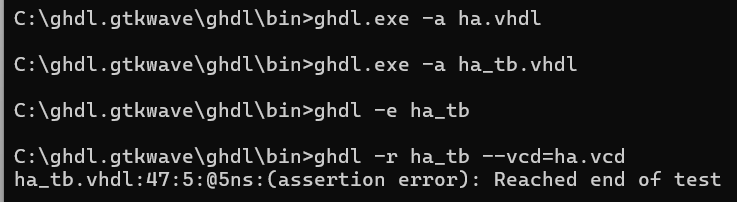

# CPE322-Lab 1
## GHDL and GTKWave
---
### Installation
The instructions for installing GHDL and GTKWave were successfully followed, resulting in both software packages being downloaded, extracted, and placed in the appropriate directories for proper functionality. Once the setup was complete, the Windows command utility was launched, and the executable files for the programs were executed via the command line to run the provided examples.

### Part 1: Half Adder Example
The initial files tested were the Half Adder example, comprising ha.vhdl and ha_tb.vhdl. These files simulate and verify the functionality of a simple half adder by varying the input signal values. The input signals, a and b, are used to compute the output signals, s and c, based on the standard half adder operations: s is determined by a XOR b, and c is computed as a AND b.

To validate the half adder, the appropriate GHDL commands were executed via the command line, successfully running the simulation test bench and producing the output wave signal file.

