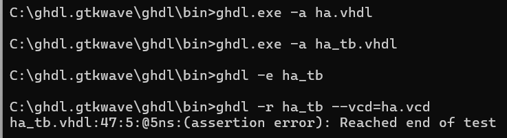
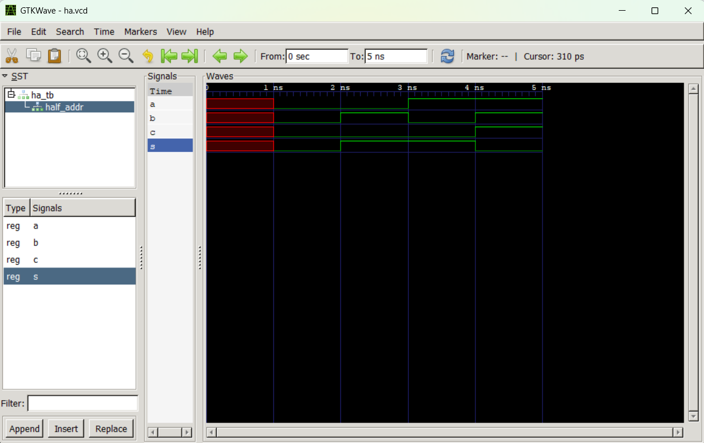
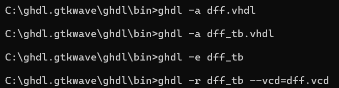
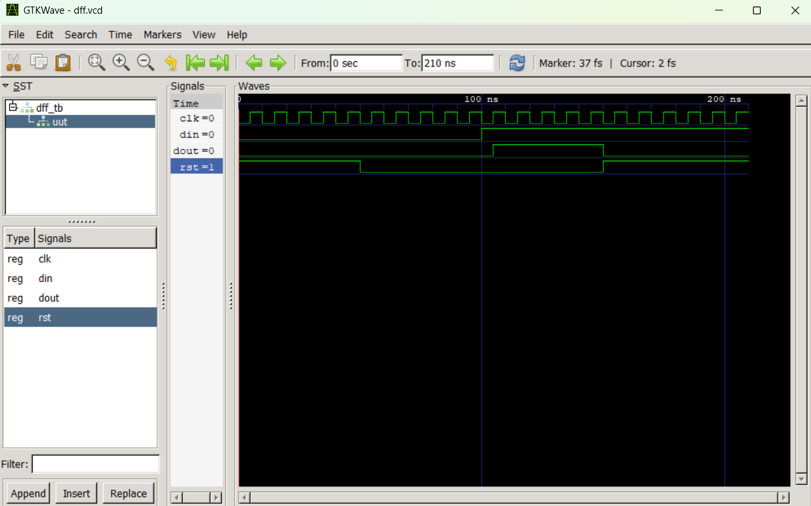

# CPE322-Lab 1
## GHDL and GTKWave
---
### Installation
The instructions for installing GHDL and GTKWave were successfully followed, resulting in both software packages being downloaded, extracted, and placed in the appropriate directories for proper functionality. Once the setup was complete, the Windows command utility was launched, and the executable files for the programs were executed via the command line to run the provided examples.

---

### Part 1: Half Adder 
The initial files tested were the Half Adder example, comprising ha.vhdl and ha_tb.vhdl. These files simulate and verify the functionality of a simple half adder by varying the input signal values. The input signals, a and b, are used to compute the output signals, s and c, based on the standard half adder operations: s is determined by a XOR b, and c is computed as a AND b.

To validate the half adder, the appropriate GHDL commands were executed via the command line, successfully running the simulation test bench and producing the output wave signal file.

The testbench varied the input values to thoroughly verify the system's behavior, and the corresponding output responses were simulated accordingly. The resulting waveforms, which align with the expected behavior of a standard half adder, were viewed in GTKWave. This was done via the command line, using a process similar to how GHDL was utilized.

Initially, all signals are undefined. When both inputs a and b are set to 0, the outputs s (sum) and c (carry) are also 0. Setting b to 1 while a remains 0 results in s = 1 and c = 0; similarly, setting a to 1 while b is 0 produces the same output. When both a and b are set to 1, s resets to 0 and c becomes 1. These results are consistent with the expected behavior of a half adder, where the carry output is high only when both inputs are high, and the sum output is high when exactly one input is high (exclusive OR).

---

### Part 2: D Flip-Flop
The second set of files evaluated was the D Flip-Flop example, comprising dff.vhdl and dff_tb.vhdl. These files describe and test a basic D-type flip-flop, analogous in simplicity to the half adder module from the previous example. The design defines clk, din, and rst as input signals, with dout serving as the output. The flip-flop behavior follows standard functionality: when rst is asserted (1), dout is asynchronously reset to 0; otherwise, on the rising edge of clk, dout samples and holds the value of din.

The same set of GHDL commands was used to analyze, elaborate, and run the testbench for this module. The simulation generated a waveform output file, which was then used for visual inspection of signal behavior.

The testbench generated a clock signal by toggling clk every 5 ns, while systematically varying rst and din to validate the flip-flop's behavior. Initially, with rst asserted (1), dout remained at 0, as expected. Once rst was deasserted (0) and din was set to 1, dout captured the din value on the next rising edge of clk, transitioning to 1. Subsequently, when rst was reasserted (1), dout was asynchronously cleared to 0, irrespective of the din value. The resulting waveform, illustrating these transitions, was visualized using GTKWave, following the same procedure used in the Half Adder example.

Both the Half Adder and D Flip-Flop examples were successfully simulated and visualized using GHDL and GTKWave. The observed signal behaviors in each case aligned precisely with the expected theoretical functionality of their respective digital components. These simulations not only confirmed the correctness of the VHDL implementations but also demonstrated the effectiveness of the GHDL/GTKWave toolchain for functional verification and waveform analysis in a digital design workflow.
