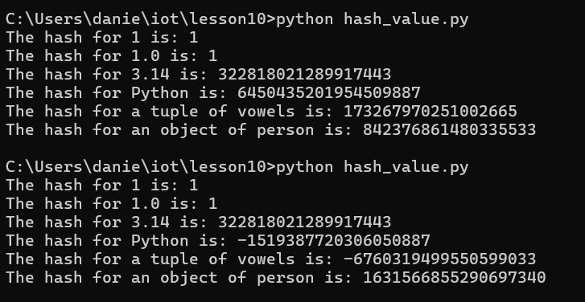
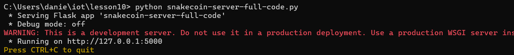
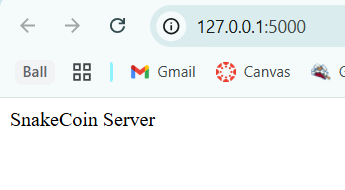
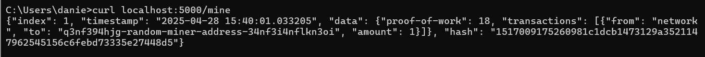
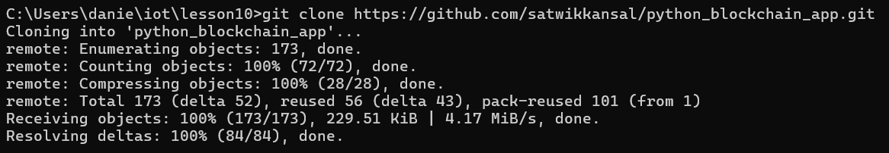
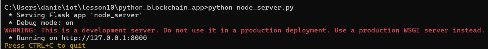
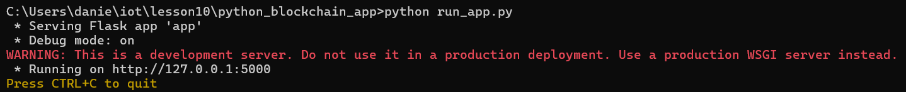
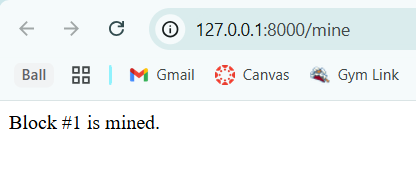
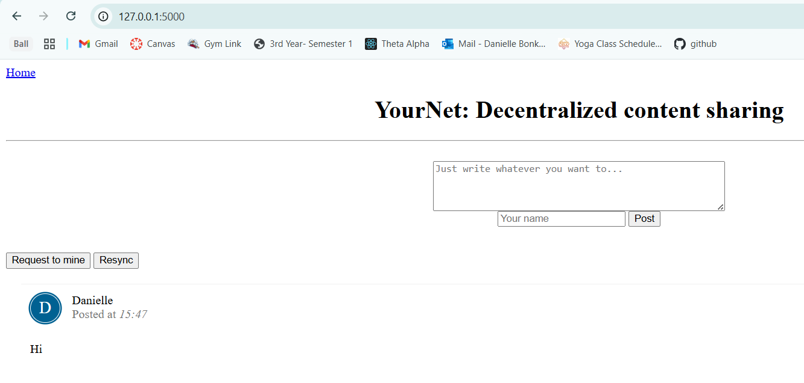

# CPE322-Lab 10
## Blockchain

---

### Part 1: SnakeCoin
The lab started by executing the hash_value.py script twice and analyzing the resulting outputs. The script consistently produced identical hash values for the first three numerical inputs across both runs; however, the remaining three values generated different hashes between executions. This behavior suggests that the hashing process incorporates randomization mechanisms, particularly for certain object types, likely due to Python's hash randomization feature for non-primitive data types.

The next file evaluated was snakecoin.py, a minimalistic implementation of a blockchain. Executing the script initiates the creation of a basic blockchain, wherein 20 blocks are sequentially mined and their corresponding hash values are output to the console.

The subsequent phase of the SnakeCoin project involved executing the snakecoin-server-full-code.py file, which launches a Flask-based web server. This server exposes an endpoint for block mining via its /mine route. When accessed, the server generates a basic webpage identifying itself as a SnakeCoin node.

A second terminal session was opened to mine a new block. It is noteworthy that attempts to issue a curl request from the Windows Command Prompt were rejected by the Flask server; however, using an MSYS2 terminal resolved the issue. Through MSYS2, a valid curl request successfully mined a block, thereby initializing the blockchain.

---

### Part 2: Python Blockchain App
The second phase of the lab concentrated on a more practical application of blockchain technology, involving deployment across two separate server instances in the terminal. The required Python files were successfully retrieved using the git clone command, enabling the local setup of the project environment.

The application was subsequently launched from the cloned repository, utilizing two primary Python scripts. First, node_server.py was executed to initialize and host the blockchain network. Following this, run_app.py was executed to deploy the content-sharing application server, which interfaced directly with the blockchain for transaction management and data retrieval.

To interact with the application, a user could submit a message along with a name through a text input field on the web interface. However, the submitted data would not be immediately visible; it first needed to be recorded on the blockchain. To initiate this process, the "Request to Mine" button was pressed, triggering the mining of a new block. Once mining was completed, the submitted messages were encapsulated within the newly mined block and subsequently displayed on the webpage, reflecting their successful addition to the blockchain.

