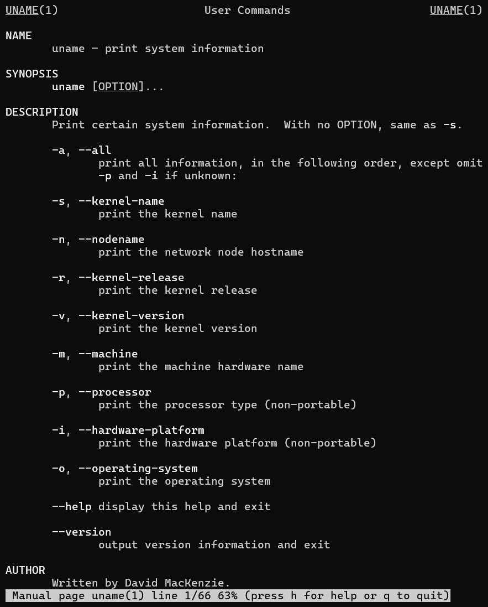

# CPE322-Lab 2
## Command Line
---
### Overview
This lab exercise explores foundational terminal-based operations for performing system-level tasks, querying system information, and managing file structures through command-line interfaces. As many operating systems share a common set of command-line utilities, this lab emphasizes platform-independent concepts using the Windows Command Prompt environment. The Windows terminal was selected due to the host system configuration, allowing for the demonstration of standard command-line functionality in a Windows context.

---

### Command: hostname
Displays the name of the current machine on the network

### Command: env
Lists all environment variables for the current user session

### Command: ps
Shows currently running processes for the user

### Command: pwd
Prints the full path of the current working directory

### Command: git clone 
Downloads the contents of the specified GitHub repository to the local machine

### Command: cd iot
Changes the working directory to the iot folder

### Command: ls
Lists all files and directories in the current directory

### Command: cd
Returns to the user's home directory

### Command: df
Displays disk space usage for all mounted file systems

### Command: mdkir demo
Creates a new directory named demo

### Command: cd demo
Changes into the demo directory

### Command: nano file
Opens or creates a file named file in the Nano text editor

### Command: cat file
Displays the contents of file in the terminal

### Command: cp file file1
Copies file to a new file named file1

### Command: mv file file2
Renames or moves file to file2

### Command: rm file2
Deletes the file named file2

### Command: clear
Clears all previous terminal output

### Command: man uname
Opens the manual (help documentation) for the uname command

### Command: uname -a
Displays detailed system information including kernel name, version, and machine type

### Command: ifconfig
Shows network interface configurations and IP addresses

### Command: ping localhost
Sends test packets to the local machine to check basic network connectivity

### Command: netstat
Displays network connections, routing tables, and interface statistics

