# CPE 322-Lab3
## Python
### Installation
Python was pre-installed on the Windows system used for this lab, with the terminal command python mapped to the Python 3 interpreter, rather than the conventional python3 used in UNIX-based systems. All necessary packages were installed via pip, and any additional dependencies not explicitly listed were automatically resolved and installed by Python during the execution of individual scripts.

---

### Libraries 
**jdcal:**

The jdcal library is designed for converting between Julian dates and standard Gregorian calendar dates. It provides functions to convert dates into Julian days and vice versa, which is essential for precise date arithmetic and astronomical computations. This is particularly useful in fields like astronomy and timekeeping, where Julian dates are often used for calculations over long periods.

**astral:**

astral is a Python library used to calculate key astronomical events such as sunrise, sunset, solar noon, and moon phases, based on a given geographic location. This library is highly beneficial for applications that need to know the timing of these events, such as in automation systems, outdoor scheduling, and solar energy optimization. It simplifies the process of working with solar and lunar data.
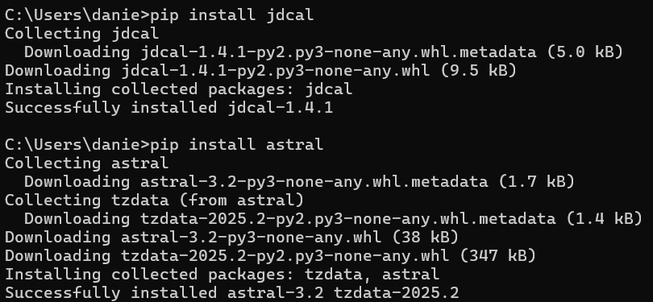

**geopy:**

geopy provides tools for geocoding, which allows the conversion of an address into geographic coordinates (latitude and longitude), and reverse geocoding, which converts coordinates back into a human-readable address. This library supports multiple geocoding services like Nominatim, Google Maps, and OpenCage, making it versatile for location-based applications, mapping, and spatial analysis.
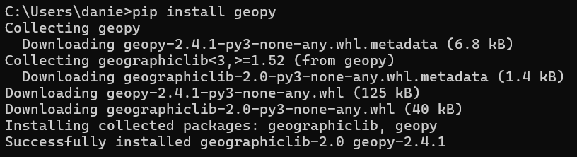

**pytz:**

pytz is a Python library that allows accurate and timezone-aware date and time manipulation. It provides the ability to convert between different timezones, ensuring that time calculations account for timezone offsets, daylight saving time (DST), and other complexities. By using pytz, developers can ensure that their applications handle time correctly across various global regions, which is crucial for applications that involve scheduling, logging, or international data processing.
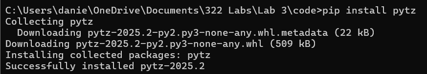

**psutil:**

psutil (Python system and process utilities) is a cross-platform library used to retrieve information on running processes and system utilization, including CPU, memory, disk, network, and sensors. It provides detailed insights into system performance and can be used for system monitoring, diagnostics, and resource management. With psutil, developers can access real-time data about CPU usage, battery status, process IDs, memory consumption, and more—making it a powerful tool for writing performance-aware or system-integrated applications.
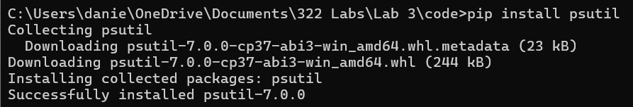

---

### Scripts 

**cd~/iot and cd*3**

On the Windows command line, the cd ~/iot command navigates to the iot directory located within the user's home directory. The cd *3 command uses wildcard expansion to enter a subdirectory with a name ending in "3" (e.g., lab3 or module3), assuming such a directory exists.
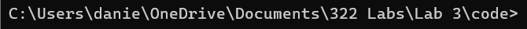

**Julian.py**

Prints the current date, the Julian calendar date and the Modified Julian calendar date for date ran
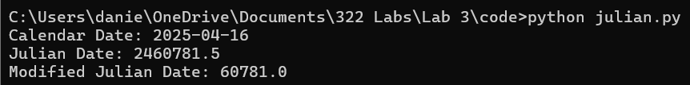

**date_examples.py**

Prints the date in multiple formats, stating the month, year, and the day of the week, as well as stating the number of days away from the first and last days of classes
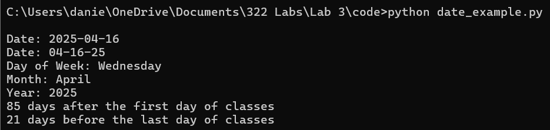

**datetime_example.py**

Prints an extremely precise system date and time several times in the terminal
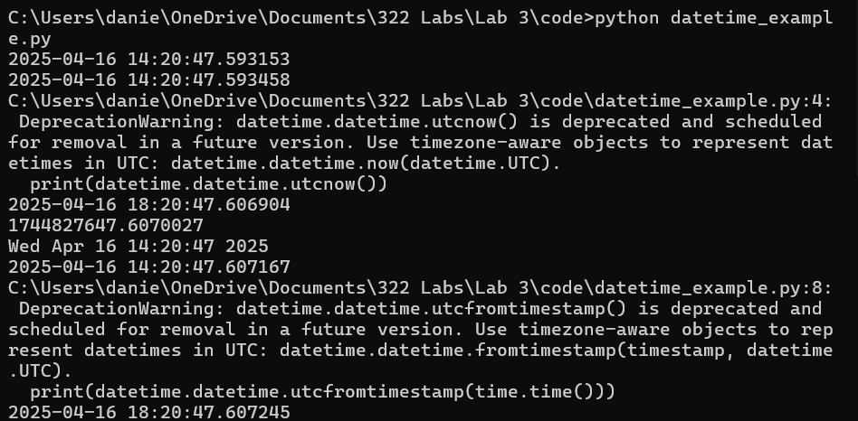

**time_example.py**

Prints the system date and time as a formatted string every 10 seconds 
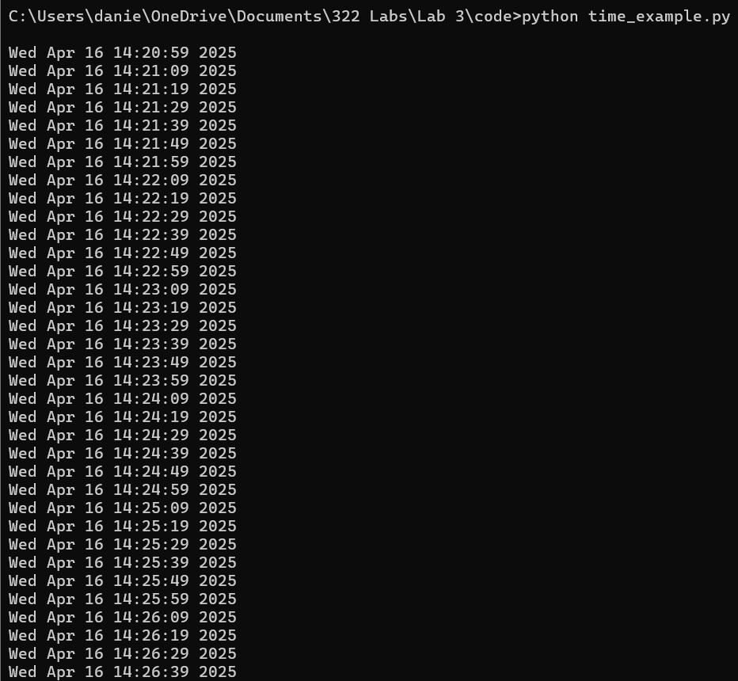

**sun.py "New York"**

Prints the time zone, latitute, longitude, and times for dawn, sunrise, noon, sunset, and dusk for New York
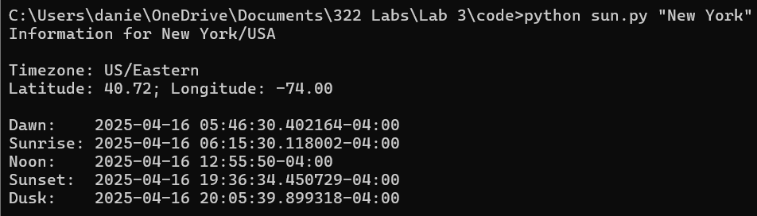

**moon.py**

Prints the numerical moon phase for each day over the next month from the current date
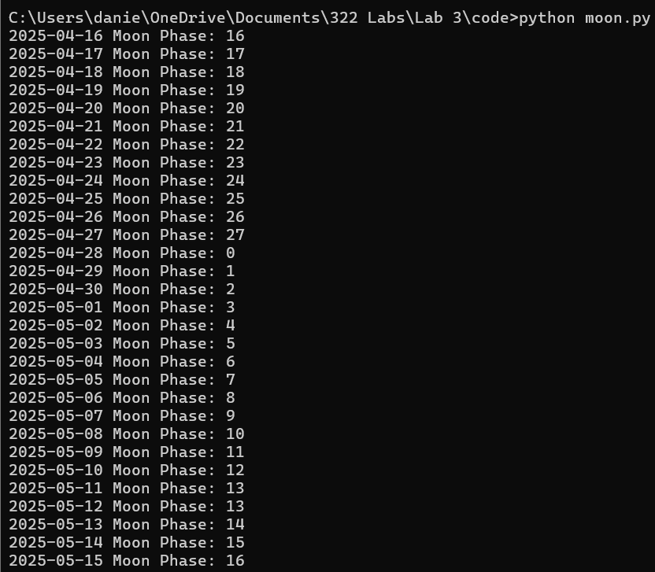

**coordinates.py "Samuel C. Williams Library"**

Prints the address and exact latitude and longitude coordinates for "Samuel C. Williams Library."
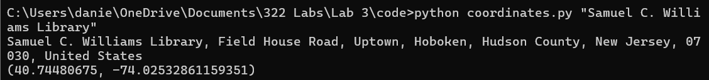

**address.py "40.74480675, -74.02532861159351"**

Prints the input pair of latitude and longitude coordinates and printing the address found at those coordinates
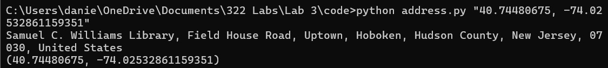

**cpu.py**

Prints the number of physical and logical CPU cores for the system, then repeatedly prints the utilization percentage for each CPU core
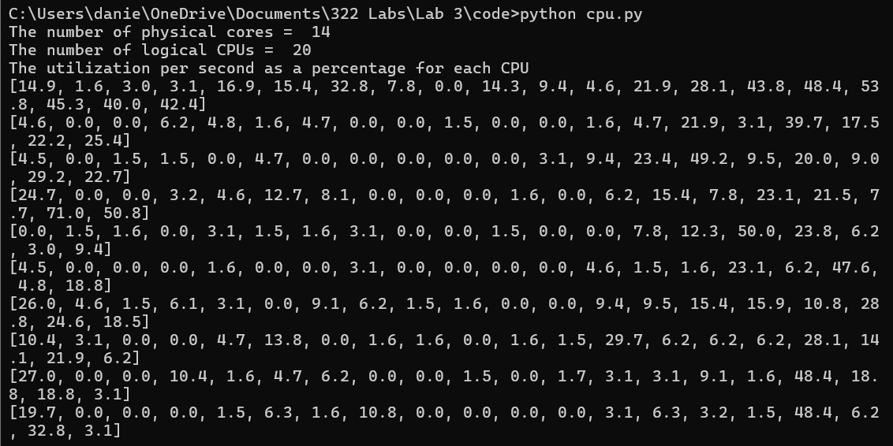

**battery.py**

Prints system battery statistics such as percentage, estimated time remaining for the battery, and charging status
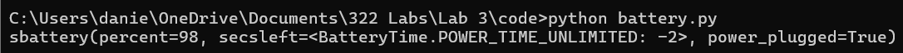

**documentstats.py document.txt**

Opens the input document file, and analyzes it, counting its words and returning the total word count and the top 10 most used words in the document
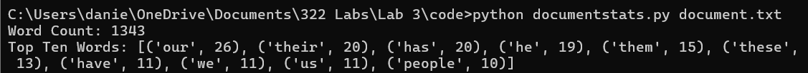
