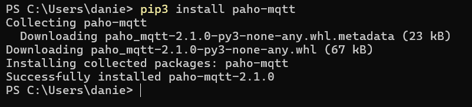
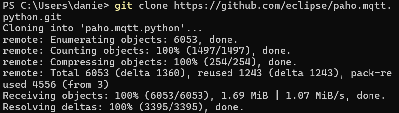
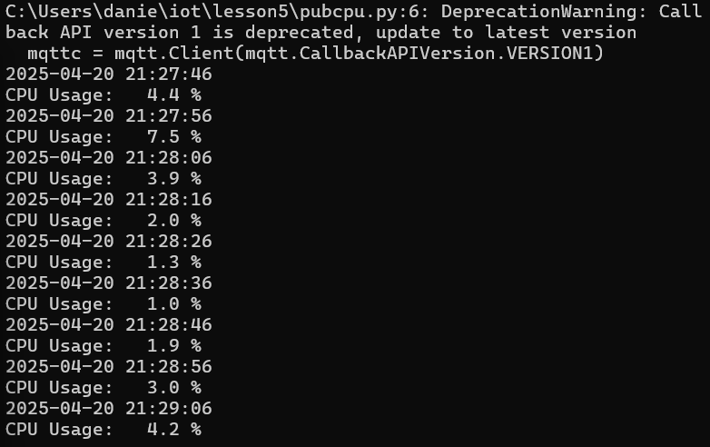
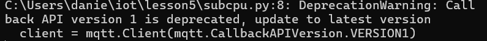

# CPE322-Lab 5
## Paho-MQTT

---

### Installation 
The lab commenced with the installation of the Paho-MQTT library via pip, employing the standard Python package management workflow. 
The installation process completed without errors, as confirmed by the terminal output.

Then git clone the necessary repository.

---

### MQTT Setup
Following the successful installation of Paho-MQTT, the local repository was updated via git pull. While the pull operation executed without errors, it did not result in any modifications to files relevant to this lab exercise.

Subsequently, two separate Windows terminal instances were launched, each running a distinct Python script. The first script, pubcpu.py, was executed to periodically publish the system’s current CPU utilization to the MQTT broker. In parallel, the second terminal ran subcpu.py, which subscribed to the same MQTT topic and received the published CPU data. The setup functioned as expected: CPU utilization values published by pubcpu.py appeared in real time on the second terminal via subcpu.py.

