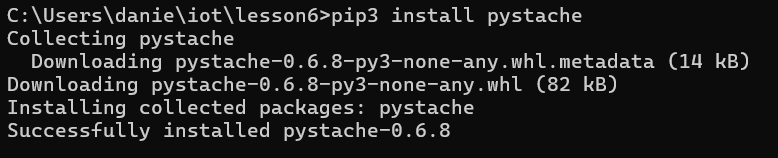
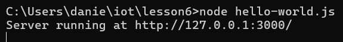
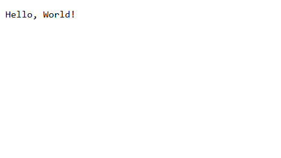
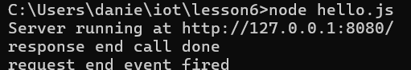
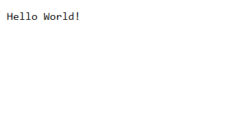
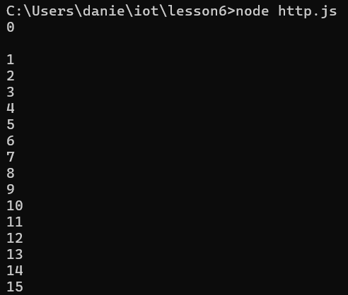
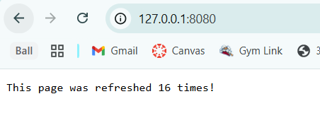
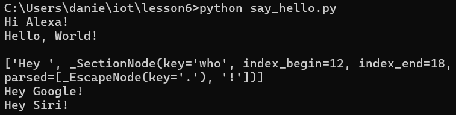

# CPE322-Lab 6
## Node.js and Pystache

---

### Installation 
Node.js was installed by downloading the official Windows installer from the Node.js website and executing it. The installer successfully set up Node.js along with its required dependencies, including npm (Node Package Manager). Post-installation, the command line confirmed a successful setup by displaying the installed versions of Node.js and npm via the node -v and npm -v commands, respectively. Additionally, the availability of core CLI commands indicated that the environment was correctly configured.

In the second portion of the lab, the Pystache library was installed using pip as a standard Python package. The installation completed successfully, with no errors reported by the terminal.

---

### Node.js
In the initial portion of the lab, Node.js was used to execute several JavaScript files on a local web server to validate their functionality.

The first script, hello-world.js, was run using the node command. Upon execution, it started an HTTP server on localhost at port 3000. When accessed through a web browser, the server responded with a simple HTML page displaying the message "Hello, World!", confirming the successful setup and basic operation of the Node.js server.

The second script, hello.js, was executed using the same process with the node command. Like the previous script, it launched a simple HTTP server that served a "Hello World" webpage upon access. However, in addition to rendering the page in the browser, this script included server-side logging functionality: when a client accessed the page, a corresponding message was printed to the terminal, confirming the request and indicating that the server had successfully handled it.

The third script, http.js, served a dynamic webpage that displayed the number of times the page had been accessed. Each time the page was refreshed or revisited, the counter incremented and updated both on the webpage and in the terminal where the script was running. Notably, the counter maintained its state across page closures, indicating that the count was stored and managed on the server side rather than being reset with each client session.

---

### Pystache
In the second portion of the lab, the previously installed Pystache library was utilized to execute the test script say_hello.py. Pystache is a Python implementation of the Mustache templating language—a logic-less, cross-language system for rendering data into text formats such as HTML.

The say_hello.py script demonstrated the use of Pystache by iterating over a list and rendering multiple formatted strings prefixed with “Hey.” Instead of relying on traditional view logic or JavaScript-based DOM manipulation, the script used Mustache-style templates to separate data from presentation, showcasing a clean and reusable approach to string and HTML content generation.

