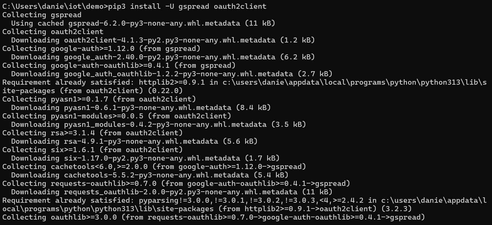

# CPE 322-Lab 7
## ThingSpeak and Google Sheets

---

### Part 1: ThingSpeak
The initial part of the lab involved using ThingSpeak, MathWorks’ cloud-based data analysis platform, to collect and visualize system CPU and memory usage data. An existing MathWorks account, previously used with MATLAB, was used to log into ThingSpeak. A new channel named cpu_loop was created, featuring two fields: cpu_data for logging CPU usage percentage and mem_avail_mb for tracking available memory in megabytes.

The necessary Python files, thingspeak_cpu_loop.py and thingspeak_feed.py, were placed in a demo folder. The thingspeak_feed.py script was then executed using Python. Upon launch, the program prompted for a ThingSpeak API key, which was copied from the ThingSpeak website, entered into the provided text field, and saved. Once configured, the script began printing and uploading system CPU and memory data to the ThingSpeak server, where the data was visualized in real time on two separate graphs.

---

### Part 2: Google Sheets

Install gspread and oauth2client

The second part of the lab began with the creation of a new Google Cloud project named cpudata, where the Google Drive and Google Sheets APIs were enabled. Instead of using an API key, a service account was created to automate interactions with a Google Sheet. The service account's credentials were downloaded as a .json key file, which, along with the cpu_spreadsheet.py script, was placed into a demo directory.

A new Google Sheet, also named cpudata, was created using the primary Google account. All rows except the first were cleared, and header labels were entered into the first row. The spreadsheet was then shared with the service account’s email address from the .json key file, granting it edit permissions to enable API-based updates.

The cpu_spreadsheet.py script was then executed from the demo directory. It began collecting, printing, and uploading system CPU and memory usage data, inserting the information into new rows of the cpudata spreadsheet via the authorized service account and Google Cloud APIs.

