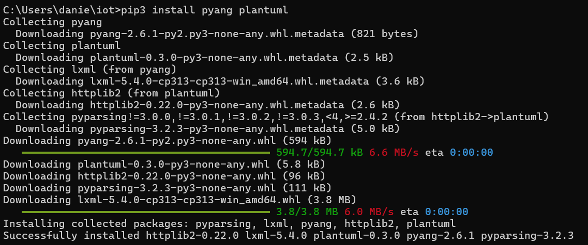
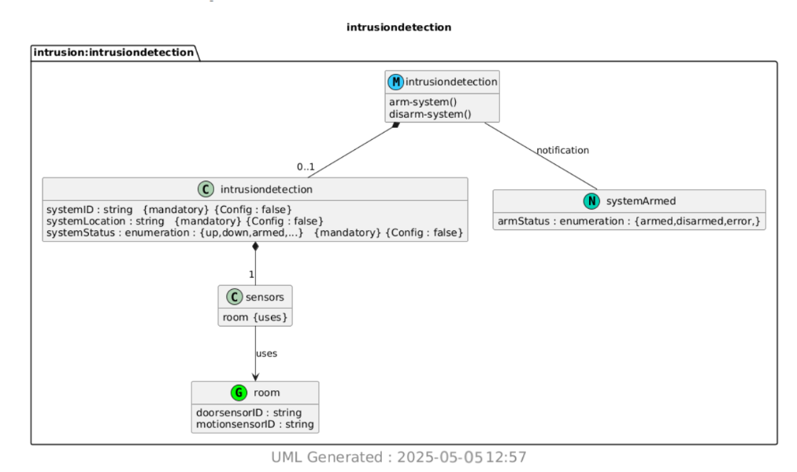

# CPE 322- Lab 9
## YANG

---

### Installation

This lab required the installation of two Python packages, which were installed using pip like any standard Python package. The installation completed successfully, as confirmed during the setup process.

The lab began by copying the intrusiondetection.yang file into the demo directory. Once in place, a series of command-line instructions were executed to process the file—first converting the .yang file into a corresponding .yin file, and then converting the .yin file into a .uml file. This workflow enabled the transformation of the YANG data model into the Universal Modeling Language (UML) format. The terminal output confirmed the successful execution of each step, and all necessary intermediary files were generated in the demo directory.

After the .uml file was generated, it was processed using PlantUML to visualize the data model as a .png image. This step completed successfully, resulting in a clear graphical representation of the data model. The final visualized image was produced without errors and is displayed as intended.

